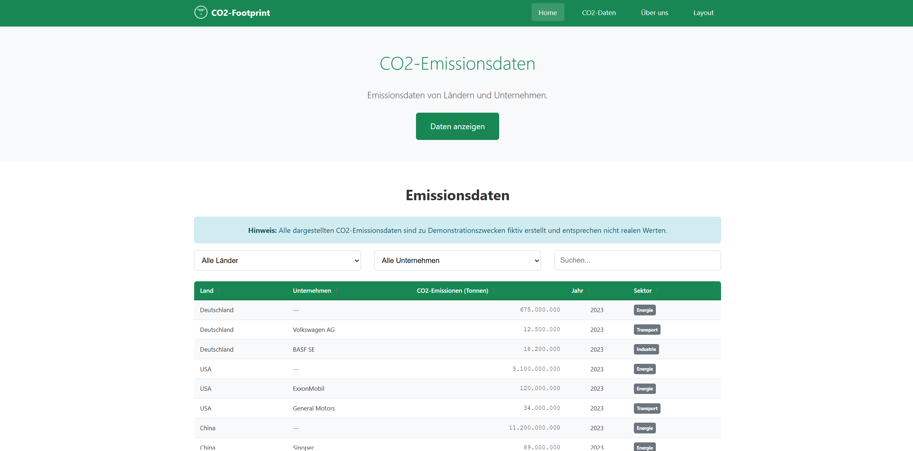
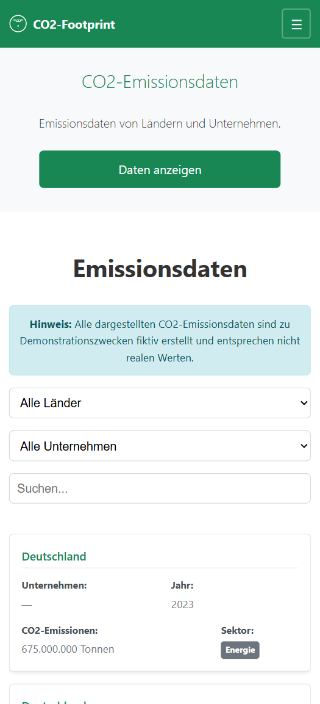

# CO2-Footprint

Interaktive Übersicht (fiktiver) CO₂‑Emissionsdaten von Ländern und Unternehmen – bewusst leichtgewichtiger Vanilla‑Stack.

## Hauptfunktionen

- Interaktive Emissionstabelle: Anzeige und Vergleich mit klarer Struktur
- Filtern & Suchen: nach Land, Unternehmen, Freitext
- Datensortierung: z. B. nach Emissionen/Jahr
- Responsives Design: optimiert für Desktop und Mobil
- RTL/LTR‑Support und Basis‑XSS‑Schutz

## Technologie‑Stack

- HTML5, CSS3 (Bootstrap 5.3.2)
- Vanilla JavaScript
- Datenquelle: `data/co2-data.json`

## Erste Schritte

Voraussetzungen: aktueller Browser. Optional: Node.js zum lokalen Dev‑Server.

Installation/Klonen:
```bash
git clone https://github.com/kenanerguel/CO2-Footprint.git
cd CO2-Footprint
```

Anwendung starten (Variante A – Live Server):
```bash
npx live-server --port=3000
# läuft dann auf http://localhost:3000
```

Anwendung starten (Variante B – direkt öffnen):
- `index.html` im Browser öffnen

## Projektstruktur

```
CO2-Footprint/
├── index.html
├── css/
│   └── custom.css
├── js/
│   └── main.js
├── data/
│   └── co2-data.json
├── assets/
│   └── logo.svg
├── docs/
│   └── screenshots/
│       ├── desktop-ansicht.png
│       └── mobile-ansicht.png
├── server.js
└── test/
    └── website-test.html
```

## Screenshots

### Desktop


### Mobil


## Hinweis zu Daten

Alle dargestellten Emissionsdaten sind zu Demonstrationszwecken fiktiv.

## Lizenz

MIT