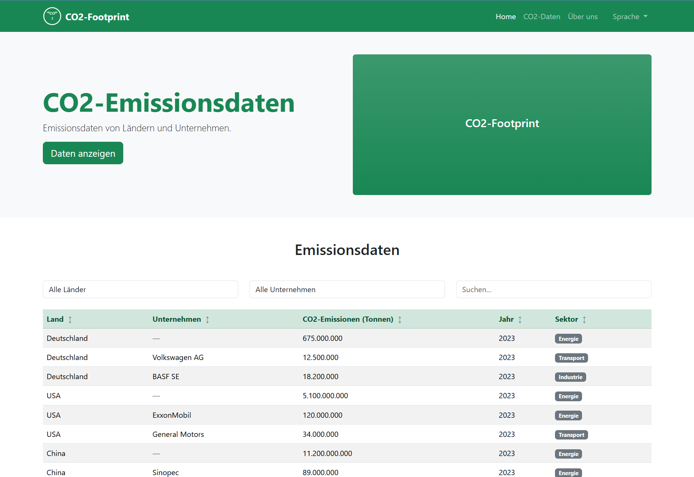
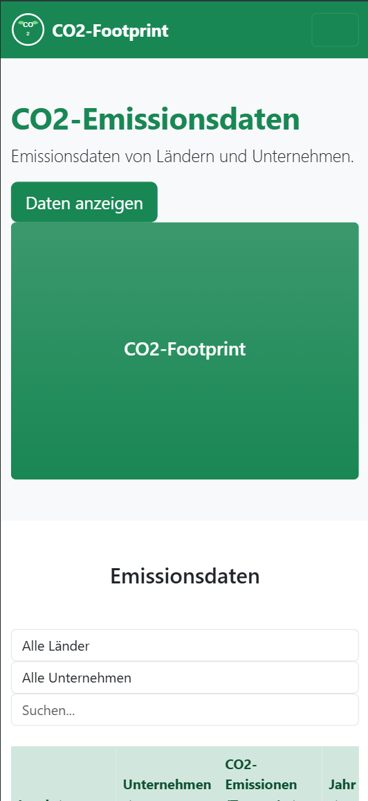

# CO2-Footprint

Webseite für CO2-Emissionsdaten von Ländern und Unternehmen.

Responsive Webanwendung mit HTML5, Bootstrap 5 und Vanilla JavaScript.

## Screenshots

### Desktop Ansicht


### Mobile Ansicht


## Anforderungen

### a) Titel und Logo
- Titel "CO2-Footprint" im Header
- Logo in der Navigation

### b) Layout-Struktur
- Header mit Navigation
- Content-Bereich mit Datentabelle
- Footer mit rechtlichen Hinweisen

### c) RTL/LTR Support
- Sprach-Toggle zwischen Deutsch und Arabisch
- Layout-Anpassung mit `dir="rtl"`

### d) Responsive Design
- Bootstrap Grid System
- Mobile Navigation

### e) CO2-Datentabelle
- Sortierbare Spalten
- Filter nach Land und Unternehmen
- 30 Datensätze

### f) Sicherheit
- XSS-Schutz mit `textContent`
- Input-Sanitization
- CSP Header

## Installation

```bash
# Repository klonen
git clone [REPOSITORY_URL]
cd CO2-Footprint

# Server starten
npx live-server --port=3000
```

URL: `http://localhost:3000`

## Technologien

- HTML5
- CSS3 + Bootstrap 5.3.2
- Vanilla JavaScript
- Live-Server für Development

## Projektstruktur

```
CO2-Footprint/
├── index.html
├── css/custom.css
├── js/main.js
├── data/co2-data.json
├── assets/
├── test/
└── docs/
```

## Datenmodell

```javascript
{
  "id": "de-2023-001",
  "country": "Deutschland",
  "company": "Volkswagen AG",
  "emissions": 675000000,
  "year": 2023,
  "sector": "Automotive"
}
```

## Sicherheit

```javascript
// XSS-Schutz
element.textContent = userInput; // Sicher
element.innerHTML = userInput;   // Unsicher
```

## RTL-Support

```css
[dir="rtl"] .navbar-nav {
    margin-right: auto !important;
    margin-left: 0 !important;
}
```

## Testing

Test-Checkliste: `test/website-test.html`

Browser-Kompatibilität:
- Chrome 90+
- Firefox 90+
- Safari 14+
- Edge 90+